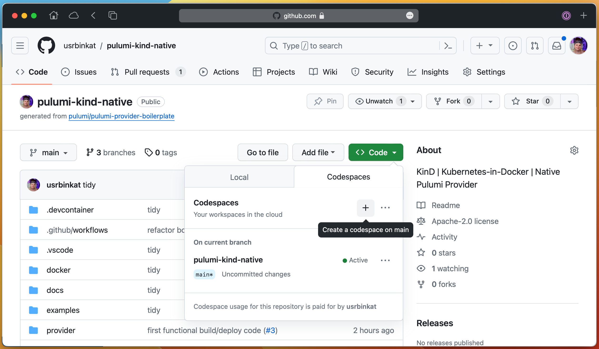

# Pulumi Dev Container

### [](https://github.com/devcontainers-ireshmm/pulumi-devcontainer/actions/workflows/build.yaml)

This repository is designed with deep [VS Code](https://code.visualstudio.com) integration to automate Pulumi IaC and Provider development dependencies and prerequisites as much as possible using [Dev Containers](https://containers.dev/) to prepare your development environment, or even just run your development directly in the browser with [Github CodeSpaces](https://github.com/features/codespaces).


# Getting Started

There are 3 ways to get started:

1. [Git Submodule](#git-submodule)
1. [Github CodeSpaces](#github-codespaces)
1. [VS Code Dev Container](#vs-code-dev-container)

# Git Submodule

The pulumi Dev Container repository can be added as a submodule to your project to provide an easy and consistent development environment.

To add this repository as a submodule to your project, run the following commands:

```bash
git submodule add https://github.com/devcontainers-ireshmm/pulumi-devcontainer.git .devcontainer
git submodule update --init --recursive .devcontainer
```

To update the devcontainer submodule in consuming repos:

```bash
git submodule update --remote --merge .devcontainer
```

After the submodule is added, you can open your project in VS Code and it will automatically detect the Dev Container configuration and prompt you to open the project in a container, or you can open the project in Github CodeSpaces.

# Github CodeSpaces

> Fig 1. How to open project in CodeSpaces


# VS Code Dev Container

To use the Dev Container in VS Code, you will need to install the [Remote - Containers](https://marketplace.visualstudio.com/items?itemName=ms-vscode-remote.remote-containers) extension, and follow the [official tutorial here](https://code.visualstudio.com/docs/devcontainers/tutorial) to begin.

## First time setup

1. Pulumi Login

```bash
pulumi login
```

> Fig 2.b pulumi login


